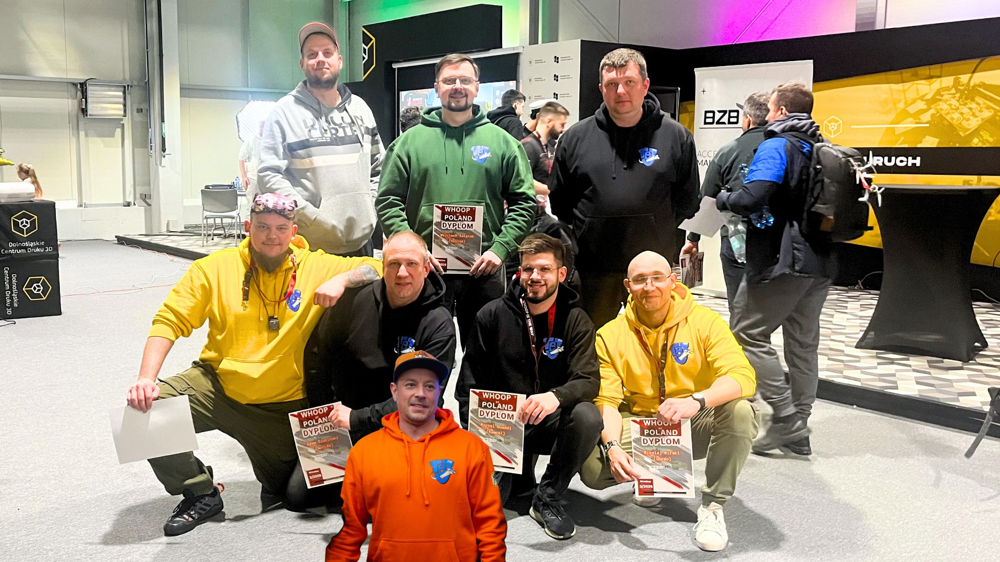

28 marca we Wrocławiu odbyły się trzecie zawody "mini sezonu" ligi Whoop of Poland 2026. Nasz poznański klub reprezentowało siedmiu pilotów: Polop, Bunias, Chicken, Paskuda, Gordo oraz dwóch debiutantów: Ramcel i Hagios. 

### Format zawodów

W zawodach w klasie MIX wzięło udział 40 zawodników z całej Polski oraz Czech. Klasa MIX oznacza, że zawody odbyły się w nastepującym formacie:
- eliminacje - zawodnicy mieli tym razem sześć przelotów, w których musieli wykręcić najlepsze czasy na dwóch następujących po sobie okrążeniach. 32 najszybszych pilotów przeszło dalej. Ci, którzy zajęli miejsca od 17 do 32 trafili do drabinki SPORT, miejsca od 1 do 16 trafiły do drabinki ELITE.
- kwalifikacje - oddzielne dla kategorii SPORT i ELITE. Zawodnicy rywalizowali w wyścigach czteroosobowych o wspięcie się jak najwyżej po szczeblach drabinki. Dwóch najlepszych w każdym przelocie awansowało wyżej a celem było oczywiście dojście do finału.
- pojedynczy finał klasy SPORT - zwycięzcą zostaje pilot, który wygra wyścig finałowy.
- finał klasy ELITE w formacie Chase The Ace - zwycięzcą zostaje pilot, który wygra dwa wyścigi finałowe (niekoniecznie pod rząd).

### Wyniki

#### Najlepsza trójka w klasie SPORT:

| Miejsce | Pilot |
|-------:|------|
| 🥇 1 | Hatch FPV |
| 🥈 2 | Mociu |
| 🥉 3 | Hubus |

W tej klasie, kolejni poznańscy zawodnicy zajęli następujące miejsca:

 #7 Polop  
 #9 Bunias  
 #15 Paskuda  
 #12 Ramcel  
 #17 Hagios  
 #19 Chicken  

#### Najlepsza trójka w klasie ELITE:

| Miejsce | Pilot |
|-------:|------|
| 🥇 1 | Split |
| 🥈 2 | TheRedMati |
| 🥉 3 | Stachu |

Do klasy ELITE doleciał również jeden z naszych zawodników. Gordo zajął 13 miejsce (tak samo jak na poprzednich zawodach w Radomsku).

Niżej rolka z Insta ze zdjęciami podium i pełną tabelą wyników.



### Relacja

Transmisja z całego wydarzenia dostępna jest na oficjalnym kanale ligi Whoop of Poland ...



 Na koniec pamiątkowe zdjęcie ... no a nasz Chicken cały dzień znikał akurat gdy robiliśmy fotki i znowu jest doklejony 😄

