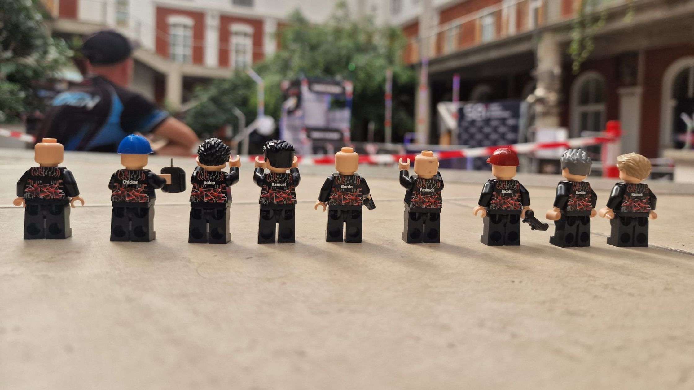
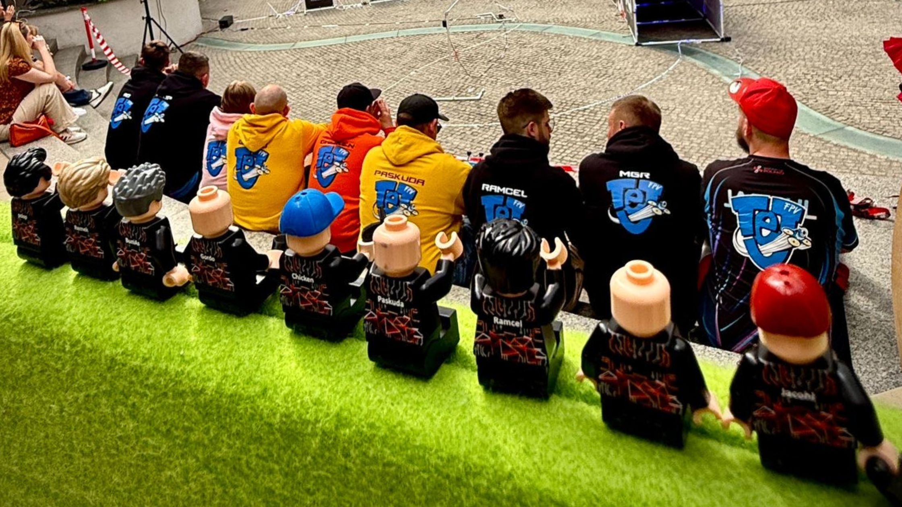

W dniach 23-24 maja w Łódzkim Instytucie Postępowania Twórczego odbyły się finały mini sezonu ligi Whoop of Poland. Reprezentacja z Poznania liczyła 9 pilotów:

- Bunias,
- Chicken,
- Gordo,
- Jacohl,
- MGR,
- Paskuda,
- Polop,
- Ramcel, 
- Remek.

Dodatkowo Janek -  nasz lokalny Race Director - został zaproszony przez zespół Whoop of Poland do pomocy przy stole dyrekora wyścigu, dzięki czemu mógł zdobywać doświadczenie od organizoatora najlepszych zawodów Tiny Whoop w Europie. 

### Format zawodów

W formacie MIX wzięło udział 57 zawodników z Polski i Czech. 

#### Dzień 1: Kwalifikacje. 
Zawodnicy mieli w sumie 6 przelotów, w trakcie których walczyli o wykręcenie jak najlepszych czasów. Liczyły się dwa następujące po sobie okrażenia. Na ich podstawie piloci byli przydzielani do  klasy:
- Rookie,
- Sport, 
- Advanced, 
- Elite,  

w których mieli rywalizować dnia drugiego.  

#### Dzień 2: Eliminacje.
Każda z w/w klas została podzielona na drabinki, po których zawodnicy wspinali się do finału swojej kategorii. W każdym wyścigu latało 4 pilotów. Dwaj, którzy naszybciej ukońćzyli 3 okrążenia przechodzili wyżej.

#### Dzień 2: Finały.
Każda z czterech klas miała finał, w którym rywalizowali ze sobą 4 najszybsi piloci. Finał miał format "chase the ace" tzn. aby zostać zwycięzcą pilot musiał wygrać dwa wyścigi.

### Wyniki - podium każdej z klas

#### Najlepsza trójka w klasie ROOKIE:

| Miejsce | Pilot |
|-------:|------|
| 🥇 1 | Maciej0 |
| 🥈 2 | Chicken  <-- nasz klubowicz 🤘😃 |
| 🥉 3 | Ryben |

W tej klasie, kolejni poznańscy zawodnicy zajęli następujące miejsca:

 #7 Bunias  
 #8 Ramcel  
 #14 Paskuda 

#### Najlepsza trójka w klasie SPORT:

| Miejsce | Pilot |
|-------:|------|
| 🥇 1 | Papuga |
| 🥈 2 | de'Fronsak |
| 🥉 3 | MGR <-- szef naszego klubu 💪 |

W tej klasie, kolejni poznańscy zawodnicy zajęli następujące miejsca:

 #7 Remek <-- nasz najmłodszy zawodnik  
 #8 Jacohl <-- nasz debiutant  

#### Najlepsza trójka w klasie Advanced:

| Miejsce | Pilot |
|-------:|------|
| 🥇 1 | Pavo |
| 🥈 2 | ElDronado |
| 🥉 3 | Hatch FPV |

Nasz jedyny zwodnik w tej klasie - Polop - zajął 6 miejsce.

#### Najlepsza trójka w klasie ELITE

| Miejsce | Pilot |
|-------:|------|
| 🥇 1 | Pan Dron |
| 🥈 2 | PawelFPV|
| 🥉 3 | Raca |

Do klasy ELITE doleciał również jeden z naszych zawodników - Gordo. Zajął miejsce 15.

Warto podkreślić, że z miesiąca na miesiąc poziom zawodników startujących na Whoop of Poland rośnie. W klasie ELITE robi się coraz ciaśniej i wielu bardzo dobrych pilotów czasem spada o ułamki sekund do klasy Advanced. Sam finał klasy ELITE na tych zawodach zostanie zapamiętany jako ten, w którym Race Directorzy długo nie mogli rozstrzygnąć kto zwycieżył, ponieważ w jednym z wyścigów formuły Chace The Ace Pan Dron i Stachu wlecieli na metę z różnicą czasów 0.002 s. 

### Klasyfikacja generalna sezonu

Majowe zawody w Łodzi były czwartymi i ostatnimi zawodami mini sezonu. W klasyfikacji generalnej uwzględnionych zostało 80 zawodników. Trzema klubowiczami Tej FPV, którzy uplasowali się najwyżej w tabeli są:

- Gordo - miejsce 8,
- Polop - miejsce 17,
- Paskuda - miejsce 27.

### O co chodzi z tymi figurkami LEGO?

Jedną z większych ciekawostek całego wydarzenia był nietypowy dla branży sponsor główny - [Minifigs.me](https://minifigs.me). Brytyjska firma oferująca możliwość zamówienia własnej figurki LEGO.
W pakiecie startowym każdy zawodnik znalazł swoją podobiznę z LEGO razem z mini aparaturą sterującą - tego jeszcze nie grali 😄 . Poniżej ekipa Tej FPV z klocków.

| | |
|---|---|
|  |  |

### Pamiątkowa rolka 
Zawody Whoop of Poland, oprócz rywalizacji sportowej, charakteryzują się świetną atmosferą, którą tworzą zawodnicy i powoli rosnąca grupa kibiców tego nadal niszowego sportu.
Rzuć okiem na rolkę i zobacz jak dobrze się bawiliśmy 🥳



### Relacja

Retransmisja z całego wydarzenia dostępna jest na oficjalnym kanale ligi Whoop of Poland ...



